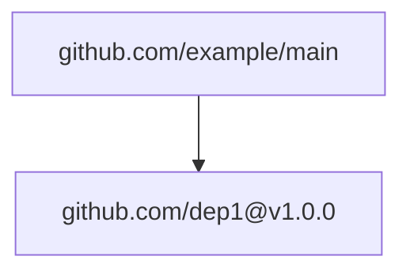
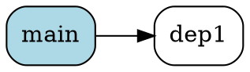

# Go Dependency Viewer

A Go tool that visualizes `go mod graph` output in multiple formats for easy dependency analysis.

## Features

- **Multiple Output Formats**: Generate visualizations in plaintext tree, HTML/D3, MermaidJS, and GraphViz DOT formats
- **Interactive HTML**: Self-contained HTML files with D3.js for interactive dependency exploration
- **Command-line Interface**: Simple CLI built with Cobra for easy integration into workflows
- **High Performance**: Efficient parsing and rendering of large dependency graphs

## Installation

### Using Go Install

```bash
go install github.com/scottbrown/tangled/cmd/tangled@latest
```

### Building from Source

```bash
git clone https://github.com/scottbrown/tangled.git
cd tangled
task build
```

## Usage

### Basic Usage

First, generate your dependency graph:

```bash
go mod graph > deps.graph
```

Then visualize it:

```bash
# Plaintext tree (default)
tangled deps.graph

# HTML with D3.js visualization
tangled -f html -o deps.html deps.graph

# MermaidJS format
tangled -f mermaid -o deps.mmd deps.graph

# GraphViz DOT format
tangled -f dot -o deps.dot deps.graph
```

### Command-line Options

```
Usage:
  tangled [graph-file]

Flags:
  -f, --format string   Output format (text, html, mermaid, dot) (default "text")
  -o, --output string   Output file (default: stdout)
  -h, --help           help for tangled
```

### Output Formats

#### Plaintext Tree
```
github.com/example/main
  ├── github.com/dep1@v1.0.0
  │   └── github.com/subdep@v1.0.0
  └── github.com/dep2@v2.0.0
```

#### HTML/D3
Interactive web-based visualization with:
- Draggable nodes
- Zoom and pan capabilities
- Hover tooltips
- Force-directed layout

#### MermaidJS


#### GraphViz DOT


## Development

### Prerequisites

- Go 1.24.5 or later
- [Task](https://taskfile.dev/) for build automation

### Building

```bash
# Install dependencies
task deps

# Run tests
task test

# Build the binary
task build

# Development workflow (format, lint, test)
task dev
```

### Project Structure

```
tangled/
├── cmd/
│   └── tangled/        # CLI entry point
├── .build/                 # Build artifacts
├── .test/                  # Test artifacts
├── parser.go              # Graph parsing logic
├── renderer.go            # Output format renderers
├── types.go               # Core data structures
├── Taskfile.yml          # Build configuration
└── README.md             # This file
```

### Testing

The project maintains >70% test coverage with comprehensive unit tests:

```bash
# Run tests with coverage
task test

# Run quick tests
task test-short

# View coverage report
open .test/coverage.html
```

## Examples

### Analyzing a Real Project

```bash
# Navigate to your Go project
cd /path/to/your/go/project

# Generate dependency graph
go mod graph > deps.graph

# Create interactive HTML visualization
tangled -f html -o dependency-analysis.html deps.graph

# Generate MermaidJS for documentation
tangled -f mermaid -o dependencies.mmd deps.graph
```

### Integration with CI/CD

```yaml
# GitHub Actions example
- name: Generate Dependency Visualization
  run: |
    go mod graph > deps.graph
    tangled -f html -o deps.html deps.graph
    
- name: Upload Dependency Report
  uses: actions/upload-artifact@v3
  with:
    name: dependency-report
    path: deps.html
```

## Contributing

1. Fork the repository
2. Create a feature branch (`git checkout -b feature/new-feature`)
3. Make your changes
4. Add tests for new functionality
5. Ensure tests pass (`task test`)
6. Submit a pull request

## License

MIT License - see LICENSE file for details.

## Acknowledgements

- Built with [Cobra](https://github.com/spf13/cobra) for CLI
- Uses [D3.js](https://d3js.org/) for interactive visualizations
- Inspired by Go's dependency management tools
